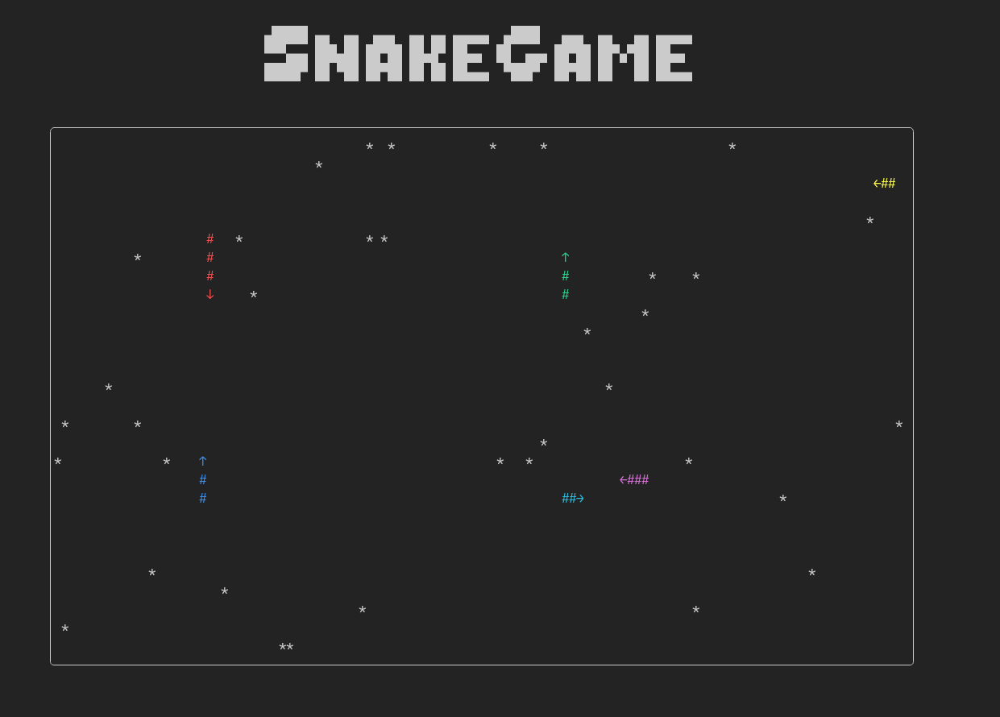

# SnakeGame



Аркадная игра Snake на C++20 с двумя режимами отображения: терминальный и графический (SFML).

## Что уже реализовано
- Архитектура разделена на `Model` / `Controller` / `View` + `Builder` для сборки `Model`.
- Терминальный рендер с центрированием контента, ASCII-баннером, рамкой поля и отдельным окном `Statistics`.
- Графический рендер на SFML: фоновая картинка `preset/img/background.jpg`, шрифт `preset/font/geist_bold.ttf`, заголовок `SnakeGame`, отдельные панели поля и статистики с округлённой рамкой.
- Окно статистики по каждой змейке: цветной превью-сегмент `##>`, статус `Alive/Dead` (для `Dead` цвет красный), `Score` (длина тела), `Kills`, тип управления (`Player 1/2`, `Dumb/Medium/Smarty`).
- Resize-логика для терминала: если текущий viewport меньше нужного размера (или больше поддерживаемого из `limits.hpp`), игровой апдейт ставится на паузу и выводится предупреждение.
- Телепортация через границы игрового поля (wrap-around), генерация кроликов в зависимости от числа змей.
- Режим чемпионата ботов `--bot_championship N`: в каждом раунде запускаются ровно 3 бота (`Dumb`, `Medium`, `Smarty`), раунд завершается при одном выжившем или по таймауту; в итоговой таблице выводятся `wins`, `survived`, `kills`.

## Алгоритмы ботов
- `Dumb`: выбирает ближайшего кролика по манхэттенскому расстоянию и едет в его сторону по доминирующей оси (`X` или `Y`).
- `Medium`: делает то же, что `Dumb`, но если следующий шаг приводит в занятую клетку, поворачивает на запасное направление (`RotateDir`).
- `Smarty`: выбирает несколько ближайших кроликов и для каждого строит путь A* по карте препятствий (`block_map`) и карте опасности (`danger_map`), затем едет по первому шагу лучшего (минимальной стоимости) пути.

## Сборка и запуск
```bash
conan install . --output-folder=build/Release --build=missing -s build_type=Release
cmake -S . -B build/Release -DCMAKE_TOOLCHAIN_FILE=build/Release/conan_toolchain.cmake -DCMAKE_BUILD_TYPE=Release
cmake --build build/Release
```

Примеры запуска:
```bash
./build/Release/snake --view_mode terminal --num_players 1 --num_bots 2 --win_size 120x34 --tic_time 100 --rabb_per_snake 5
./build/Release/snake --view_mode graphical --num_players 0 --num_bots 3 --win_size 120x34 --tic_time 80 --rabb_per_snake 5
./build/Release/snake --view_mode terminal --bot_championship 100 --win_size 120x34 --tic_time 1 --rabb_per_snake 5
```

## Управление
- Игрок 1: `W A S D`
- Игрок 2: стрелки
- `P` — пауза
- `Q` / `Esc` — выход
